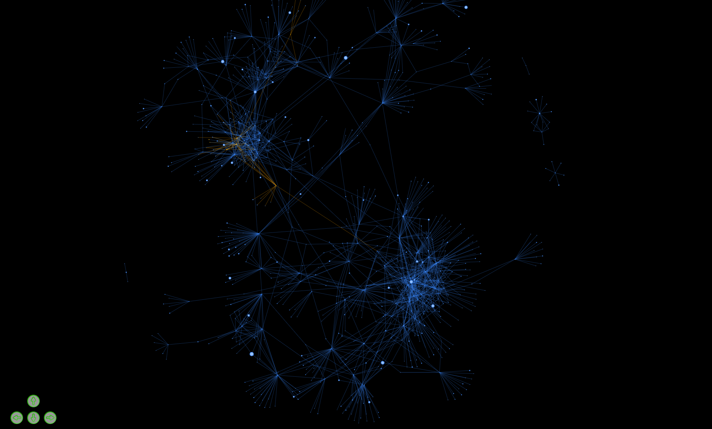

# Citation network

This script creates a interactive force-directed network graph generated by paper citations. 
- Each node represents a journal article
- Each edge represents a citation from one article to another

The goals are to:
- Find influential papers 
- Find related papers that are also influential
- Easily find relevant papers when jumping into new fields
- Find fields that are not connected

Notes
- Dataset has been exported from lens.org
- 
